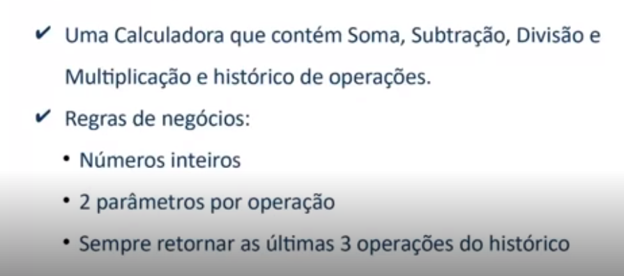

# Blindando Seu código com Tdd e Testes unitários em .Net (Dio)

# Desafio
Explore todo o potencial dos testes unitários e entenda como eles podem ajudá-lo a criar soluções cada vez mais robustas e eficientes.

criar seu próprio projeto, utilizando tdd e testes unitários.

# Regras de negócio
